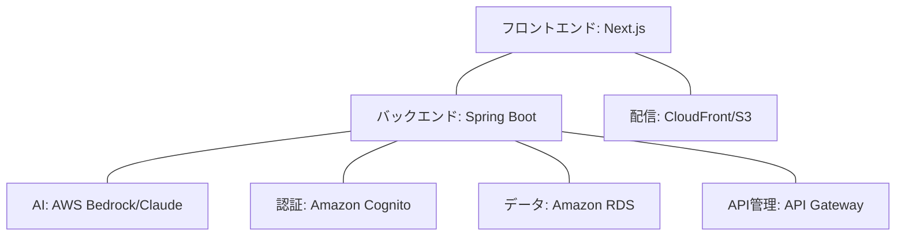

# AI Recipe Generator(※展望込み込みです)

## 📑 概要

AI Recipe Generatorは、冷蔵庫にある食材からレシピを自動生成するアプリケーションです。AWS Bedrockを活用したAI機能により、ユーザーの好みや条件に合わせたパーソナライズされたレシピを提案します。


## 🎯 目的

- 食材を無駄なく活用し、フードロスを削減
- 料理の幅を広げる創造的なレシピの提案
- 使いやすいUIでユーザー体験を向上

## 💻 技術スタック



### フロントエンド
- **Next.js 14** (App Router)
- **TypeScript**
- **Tailwind CSS** / **shadcn/ui**
- **Zustand** (状態管理)

### バックエンド
- **Spring Boot 3.2**
- **AWS Lambda** (サーバーレス)
- **Amazon RDS** (PostgreSQL)

### クラウドサービス
- **AWS Bedrock** (Claude AI モデル)
- **Amazon Cognito** (認証)
- **API Gateway** (REST API)
- **AWS CDK** (インフラのコード化)

## 🚀 主要機能

1. **🥗 食材ベースのレシピ生成**
   - 冷蔵庫の食材を入力してAIレシピを生成
   - 調理時間、難易度、料理タイプでカスタマイズ

2. **👤 ユーザー管理**
   - 好みや食事制限の設定
   - お気に入りレシピの保存

3. **🛒 食材管理**
   - 在庫食材の管理と賞味期限通知
   - 買い物リスト生成

## 📂 プロジェクト構成

```
recipe-app/
├── docs/           # プロジェクトドキュメント
├── frontend/       # Next.jsフロントエンド
├── backend/        # Spring Bootバックエンド
└── infrastructure/ # AWS CDKインフラコード
```

## 📖 ドキュメント

- [システム設計](./system-design.md) - アーキテクチャとAI連携の詳細
- [機能仕様](./functional-specs.md) - 機能とAPI仕様
- [運用ガイド](./operations.md) - 認証と運用手順

## 📝 ライセンス

MIT 