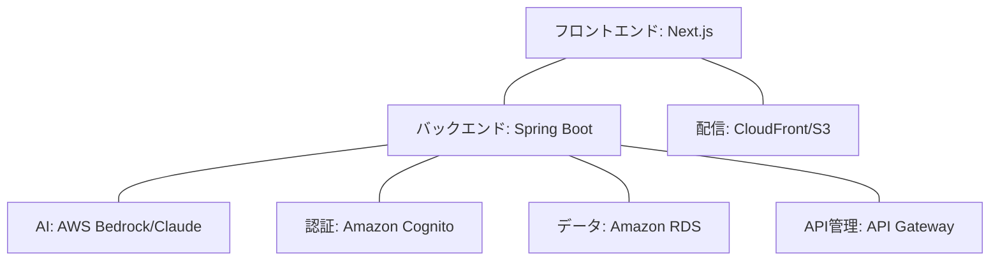

# AI Recipe Generator

## 概要

AI Recipe Generatorは、冷蔵庫にある食材からレシピを自動生成するアプリケーションです。AWS Bedrockを活用し、ユーザーの好みや条件に合わせたパーソナライズされたレシピを提案します。

- **開発状況**: 実装進行中
- **目標**: 高品質なAIレシピ生成と使いやすいUI/UX

## 目的

- 食材を無駄なく活用し、フードロスを削減
- 料理の幅を広げる創造的なレシピの提案
- 使いやすいUIでユーザー体験を向上

## 技術スタック



### フロントエンド
- Next.js 14 (App Router)
- TypeScript
- Tailwind CSS / shadcn/ui
- Zustand (状態管理)

### バックエンド
- Spring Boot 3.2
- AWS ECS（Fargate） [未実装]
- Amazon RDS (PostgreSQL) [未実装]

### クラウドサービス
- AWS Bedrock (Claude AI モデル)
- Amazon Cognito (認証) [未実装]
- API Gateway (REST API) [未実装]

## 主要機能

1. **食材ベースのレシピ生成**
   - 冷蔵庫の食材を入力してAIレシピを生成
   - 調理時間、難易度、料理タイプでカスタマイズ

2. **ユーザー管理**
   - 好みや食事制限の設定 [未実装]
   - お気に入りレシピの保存 [未実装]

3. **食材管理**
   - 在庫食材の管理と賞味期限通知 [未実装]
   - 買い物リスト生成 [未実装]

## プロジェクト構成

```
recipe-app/
├── docs/           # プロジェクトドキュメント
├── frontend/       # Next.jsフロントエンド
├── backend/        # Spring Bootバックエンド
└── infrastructure/ # AWS CDKインフラコード [未実装]
```

## ドキュメント

- [**システム設計**](./system-design.md) - アーキテクチャ、コンポーネント、データフロー、AI設計
- [**機能仕様**](./functional-specs.md) - 機能一覧、ユーザーフロー、API仕様
- [**運用ガイド**](./operations.md) - 認証システム、デプロイ手順、Docker環境

## 開発を始める

開発環境のセットアップと実行については、[Docker開発環境](./operations.md#8-docker開発環境) を参照してください。
