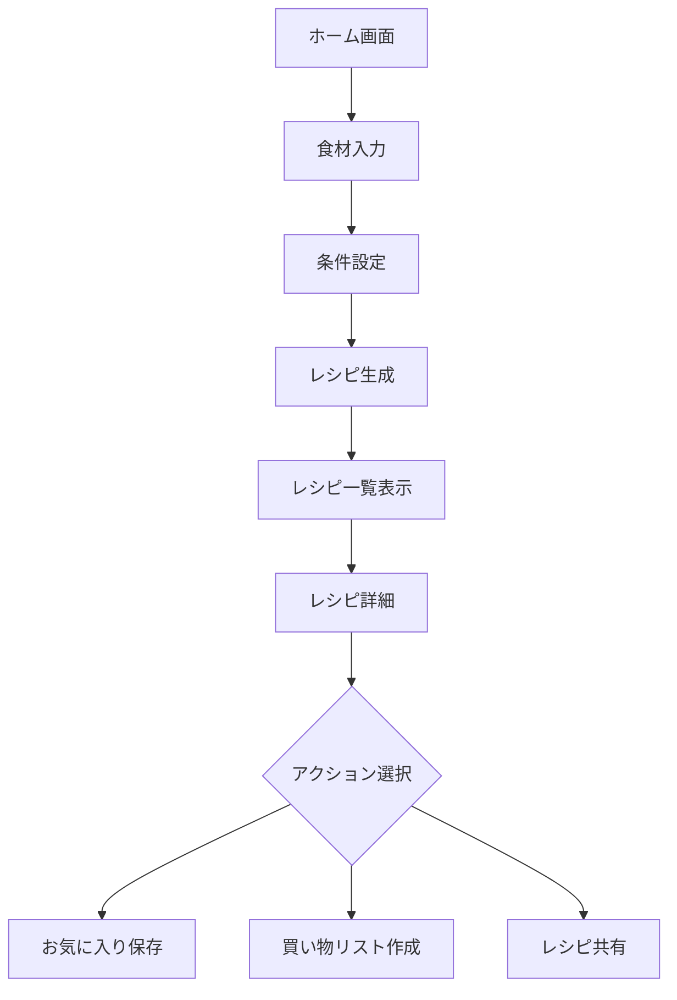
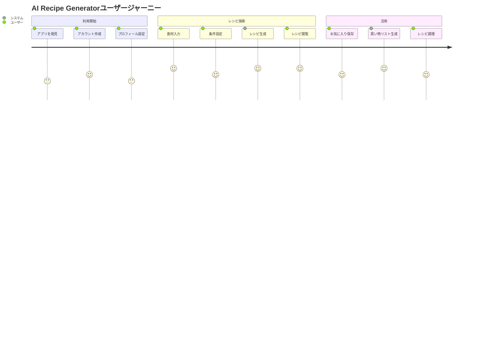
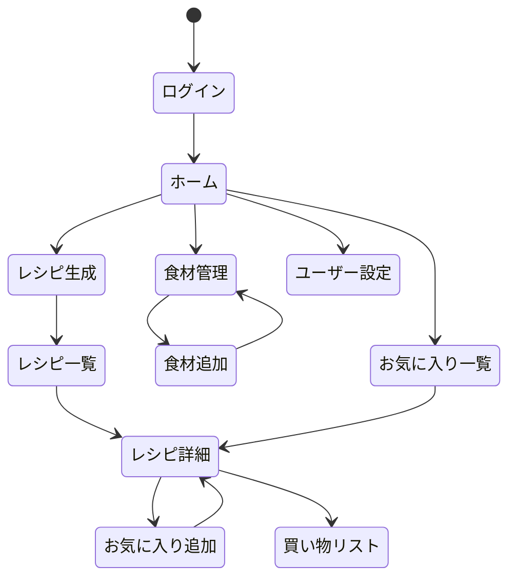

# 機能仕様

## 1. 主要機能一覧

| 機能カテゴリ | 機能概要 |
|------------|---------|
| レシピ生成 | 食材に基づいたAIレシピの提案 |
| ユーザー管理 | アカウント、プロフィール、設定の管理 |
| お気に入り | レシピの保存と整理 |
| 食材管理 | 冷蔵庫の食材在庫管理 |
| 買い物リスト | 足りない食材のリスト化 |

## 2. ユーザーフロー

### 2.1 レシピ生成フロー



### 2.2 ユーザー体験図



## 3. 機能詳細

### 3.1 レシピ生成

ユーザーが入力した食材と設定に基づき、AIが最適なレシピを提案します。

**主な機能:**
- 複数食材の入力（必須・任意の区別可能）
- 除外したい食材の指定
- 調理時間、難易度、料理タイプなどの条件指定
- 複数レシピの一括生成

**AI生成の特徴:**
- 食材の最適な組み合わせを考慮
- 調理の手順を詳細かつ分かりやすく提示
- 栄養情報の自動計算
- 代替食材の提案

### 3.2 レシピ詳細表示

生成されたレシピの詳細情報を分かりやすく表示します。

**表示情報:**
- レシピ名と概要
- 食材リスト（分量・下準備の指示付き）
- 調理手順（ステップバイステップ）
- 栄養情報
- 調理時間と難易度

**カスタマイズ機能:**
- 人数に応じた分量調整
- 代替食材の提案と置き換え

### 3.3 お気に入り管理

気に入ったレシピを保存し、効率的に管理します。

**主な機能:**
- レシピのお気に入り登録/解除
- カテゴリやタグによる整理
- 評価とメモの追加
- フィルタリングと検索

### 3.4 食材管理

冷蔵庫や食品庫の在庫を管理し、食材の無駄を減らします。

**主な機能:**
- 食材の登録と数量管理
- 消費期限の管理と通知
- 食材ベースのレシピ提案
- 在庫の自動更新（レシピ使用後）

### 3.5 買い物リスト

不足している食材をリスト化し、買い物をサポートします。

**主な機能:**
- レシピからの自動リスト生成
- 複数レシピの統合リスト
- チェックリスト機能
- 外部共有（メール、メッセージ）

## 4. API仕様

### 4.1 API概要

| エンドポイント | メソッド | 説明 |
|--------------|--------|------|
| `/api/v1/recipes/generate` | POST | レシピ生成 |
| `/api/v1/recipes/{id}` | GET | レシピ詳細取得 |
| `/api/v1/recipes/customize/{id}` | POST | レシピカスタマイズ |
| `/api/v1/favorites` | GET/POST | お気に入り管理 |
| `/api/v1/favorites/{id}` | DELETE | お気に入り削除 |
| `/api/v1/pantry` | GET/POST | 食材在庫管理 |
| `/api/v1/pantry/{id}` | PUT/DELETE | 食材更新/削除 |
| `/api/v1/shopping-list` | GET/POST | 買い物リスト管理 |
| `/api/v1/users/me` | GET/PUT | ユーザー情報管理 |

### 4.2 認証

すべてのAPIエンドポイントは認証が必要です（パブリックエンドポイントを除く）。

**認証方式**: JWT Bearer Token

```
Authorization: Bearer <token>
```

### 4.3 主要API詳細

#### レシピ生成 API

**エンドポイント**: POST `/api/v1/recipes/generate`

**リクエスト例**:
```json
{
  "ingredients": ["鶏もも肉", "じゃがいも", "にんじん"],
  "preferences": {
    "cookingTime": "UNDER_30_MIN",
    "difficulty": "EASY",
    "cuisineType": "JAPANESE",
    "mealType": "DINNER",
    "calorieLevel": "MEDIUM",
    "servingSize": 2
  },
  "excludedIngredients": ["ピーマン"]
}
```

**レスポンス例**:
```json
{
  "success": true,
  "data": {
    "recipes": [
      {
        "id": "recipe-123",
        "title": "鶏肉と野菜の簡単煮物",
        "description": "ほくほくじゃがいもと柔らかい鶏肉の優しい味わい",
        "ingredients": [
          {
            "name": "鶏もも肉",
            "quantity": "300",
            "unit": "g",
            "note": "一口大に切る"
          },
          // 他の食材...
        ],
        "instructions": [
          "鶏肉を一口大に切ります",
          "じゃがいもは皮をむき、4等分に切ります",
          // 他の手順...
        ],
        "cookingTime": 25,
        "difficulty": "EASY",
        "servingSize": 2,
        "tags": ["和食", "煮物", "晩ごはん"],
        "nutritionInfo": {
          "calories": 450,
          "protein": "28g",
          "carbs": "30g",
          "fat": "22g"
        }
      }
      // 他のレシピ候補...
    ],
    "generationId": "gen-abc123"
  }
}
```

#### お気に入り登録 API

**エンドポイント**: POST `/api/v1/favorites`

**リクエスト例**:
```json
{
  "recipeId": "recipe-123",
  "notes": "家族に好評だった。次回は塩を少し減らす。",
  "rating": 4,
  "tags": ["お気に入り", "定番"]
}
```

**レスポンス例**:
```json
{
  "success": true,
  "data": {
    "id": "fav-456",
    "recipeId": "recipe-123",
    "title": "鶏肉と野菜の簡単煮物",
    "notes": "家族に好評だった。次回は塩を少し減らす。",
    "rating": 4,
    "tags": ["お気に入り", "定番"],
    "createdAt": "2023-06-15T10:30:00Z"
  }
}
```

### 4.4 データモデル

#### レシピ

```json
{
  "id": "String",
  "title": "String",
  "description": "String",
  "ingredients": [
    {
      "name": "String",
      "quantity": "String",
      "unit": "String",
      "note": "String"
    }
  ],
  "instructions": ["String"],
  "cookingTime": "Integer",
  "difficulty": "EASY | MEDIUM | HARD",
  "servingSize": "Integer",
  "tags": ["String"],
  "nutritionInfo": {
    "calories": "Integer",
    "protein": "String",
    "carbs": "String",
    "fat": "String"
  },
  "createdAt": "DateTime"
}
```

#### ユーザー設定

```json
{
  "id": "String",
  "email": "String",
  "name": "String",
  "preferences": {
    "dietaryRestrictions": ["VEGETARIAN", "GLUTEN_FREE", ...],
    "excludedIngredients": ["String"],
    "preferredCuisines": ["JAPANESE", "ITALIAN", ...],
    "skillLevel": "BEGINNER | INTERMEDIATE | ADVANCED",
    "servingSize": "Integer",
    "caloriePreference": "LOW | MEDIUM | HIGH"
  }
}
```

## 5. 画面遷移図



## 6. 非機能要件

### 6.1 パフォーマンス

- レシピ生成応答時間: 5秒以内
- ページ読み込み時間: 2秒以内
- API応答時間: 200ms以内（AIエンドポイント除く）

### 6.2 セキュリティ

- HTTPS通信
- JWT認証
- レート制限
- 入力検証とサニタイズ

### 6.3 可用性

- 稼働率目標: 99.9%
- バックアップ: 日次
- 障害復旧時間: 4時間以内 