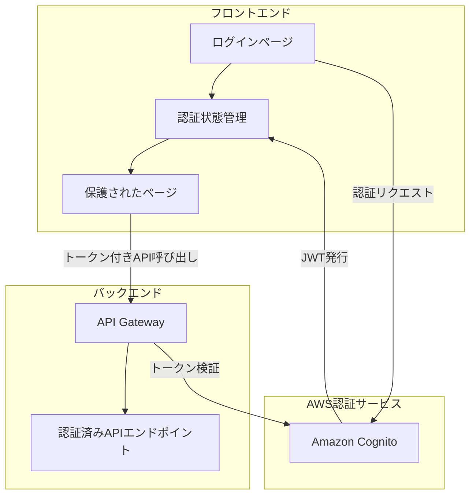
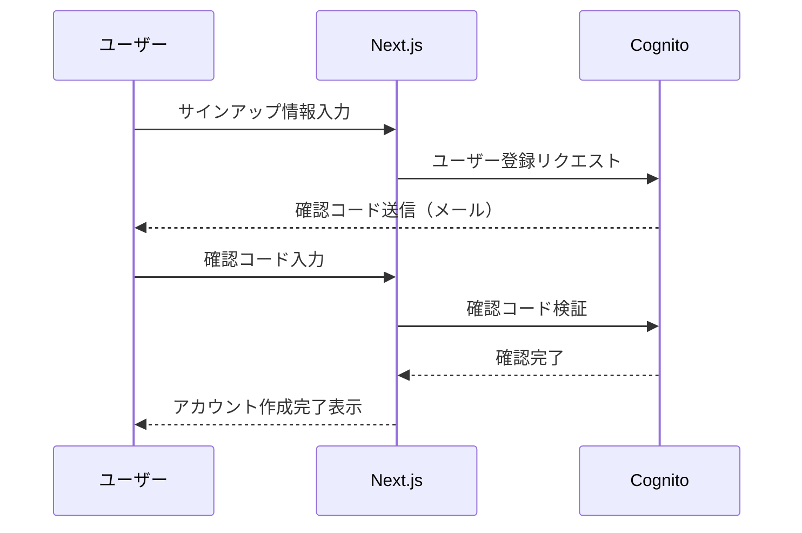
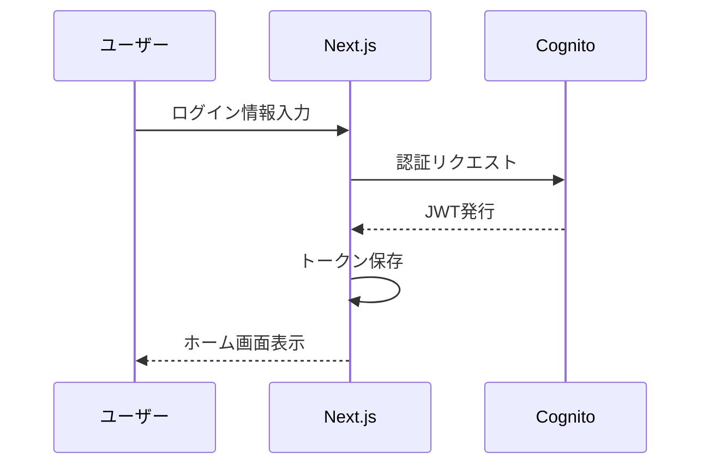
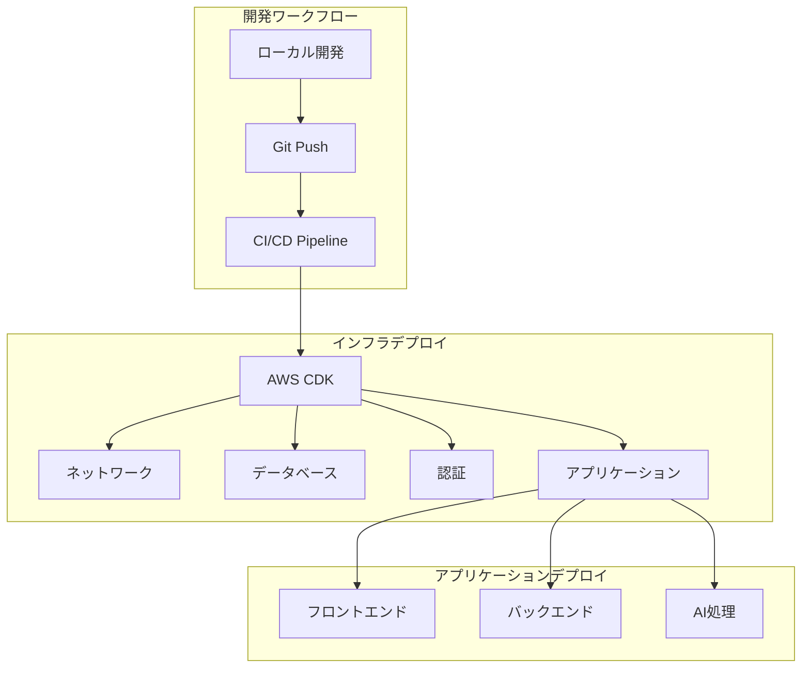
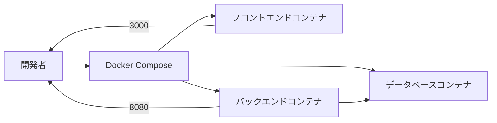

# 運用ガイド [一部未実装]

このガイドには実装済み機能と未実装機能の両方が含まれています。現在は主に開発環境の構築方法のみが実装されています。

## 1. 認証システム [未実装]

### 1.1 認証アーキテクチャ

AI Recipe Generatorでは、以下の図のように Amazon Cognito を使用した認証システムを実装予定です。



### 1.2 認証フロー

#### サインアップフロー



#### サインインフロー



### 1.3 Amazon Cognito 設定

**ユーザープール設定:**
- サインアップ属性: メールアドレス（必須）、名前（任意）
- パスワードポリシー: 8文字以上、大文字小文字・数字を含む
- メール検証: 必須
- MFA: オプション

**アプリクライアント設定:**
- 認証フロー: Authorization Code Grant + PKCE
- OAuthスコープ: openid, email, profile
- コールバックURL: https://[アプリドメイン]/auth/callback

### 1.4 フロントエンド実装

Next.jsでは以下のようにAWS Amplify SDKを使用して認証を実装しています：

```typescript
// amplify-config.ts
import { Amplify } from 'aws-amplify';

Amplify.configure({
  Auth: {
    region: process.env.NEXT_PUBLIC_AWS_REGION,
    userPoolId: process.env.NEXT_PUBLIC_USER_POOL_ID,
    userPoolWebClientId: process.env.NEXT_PUBLIC_USER_POOL_CLIENT_ID,
    authenticationFlowType: 'USER_SRP_AUTH'
  }
});

// AuthContext.tsx (認証状態管理)
export const AuthProvider = ({ children }) => {
  const [user, setUser] = useState(null);
  
  useEffect(() => {
    checkCurrentUser();
  }, []);
  
  async function checkCurrentUser() {
    try {
      const user = await Auth.currentAuthenticatedUser();
      setUser(user);
    } catch {
      setUser(null);
    }
  }
  
  // サインイン・サインアウト関数...
  
  return (
    <AuthContext.Provider value={{ user, signIn, signOut }}>
      {children}
    </AuthContext.Provider>
  );
};
```

### 1.5 バックエンド実装

Spring BootでJWT認証を処理する実装例：

```java
@Configuration
@EnableWebSecurity
public class SecurityConfig {
    @Value("${aws.cognito.jwk-url}")
    private String jwkUrl;
    
    @Bean
    public SecurityFilterChain securityFilterChain(HttpSecurity http) throws Exception {
        http
            .cors().and()
            .csrf().disable()
            .sessionManagement().sessionCreationPolicy(SessionCreationPolicy.STATELESS)
            .and()
            .authorizeHttpRequests(auth -> auth
                .requestMatchers("/api/v1/public/**").permitAll()
                .anyRequest().authenticated()
            )
            .oauth2ResourceServer(oauth2 -> oauth2
                .jwt(jwt -> jwt.decoder(jwtDecoder()))
            );
        
        return http.build();
    }
    
    @Bean
    public JwtDecoder jwtDecoder() {
        return NimbusJwtDecoder.withJwkSetUri(jwkUrl).build();
    }
}
```

## 2. デプロイ手順 [未実装]

### 2.1 デプロイアーキテクチャ (計画)

以下は将来的なデプロイアーキテクチャの計画です。



### 2.2 必要なツール [未実装]

### 2.3 環境変数設定 [未実装]

### 2.4 インフラデプロイ [未実装]

### 2.5 フロントエンドデプロイ [未実装]

### 2.6 バックエンドデプロイ [未実装]

## 3. 環境管理 [未実装]

## 4. セキュリティ対策 [未実装]

## 5. モニタリングとログ [未実装]

## 6. コスト最適化 [未実装]

## 7. 障害復旧 [未実装]

## 8. Docker開発環境 

### 8.1 概要

Docker開発環境では、以下のコンポーネントをコンテナ化して開発を容易にしています：



### 8.2 環境構築

**前提条件**:
- Docker Desktop がインストール済み
- AWS CLI が設定済み

**セットアップ手順**:

1. **リポジトリのクローン**:
   ```bash
   git clone https://github.com/yoshi88wani/recipe-app.git
   cd recipe-app
   ```

2. **AWS認証情報の設定**:
   ```bash
   mkdir -p backend/aws-config
   
   # 認証情報ファイルの作成（必ず自分の有効な認証情報に書き換えてください）
   cat > backend/aws-config/credentials << EOF
   [default]
   aws_access_key_id = YOUR_ACCESS_KEY
   aws_secret_access_key = YOUR_SECRET_KEY
   EOF
   
   # リージョン設定
   cat > backend/aws-config/config << EOF
   [default]
   region = ap-northeast-1
   output = json
   EOF
   ```

3. **Docker環境の起動**:
   ```bash
   docker-compose up -d
   ```

### 8.3 起動と停止

**起動手順**:
```bash
docker-compose up -d  # デタッチモード（バックグラウンド）で起動
```

**停止手順**:
```bash
docker-compose down   # コンテナを停止・削除
```

**データベースの永続化**:
```bash
docker-compose down   # コンテナのみ停止（ボリュームは保持）
docker-compose down -v # ボリュームも含めて完全削除（データはリセット）
```

### 8.4 アクセス方法

| サービス | URL/接続情報 |
|---------|----------|
| フロントエンド | http://localhost:3000 |
| バックエンドAPI | http://localhost:8080 |
| APIドキュメント | http://localhost:8080/swagger-ui.html |
| データベース | ホスト: localhost<br>ポート: 5432<br>ユーザー名: postgres<br>パスワード: postgres<br>データベース名: recipe_db |

### 8.5 開発ワークフロー

1. **コードの編集**: ローカルファイルを編集するとコンテナ内に自動的に反映
2. **変更の確認**:
   - フロントエンド: 自動的にホットリロード
   - バックエンド: Spring Boot Dev Toolsによる自動リロード（Javaファイル変更時）
3. **ログの確認**:
   ```bash
   docker-compose logs -f backend  # バックエンドのログをリアルタイム表示
   docker-compose logs -f frontend # フロントエンドのログをリアルタイム表示
   ```

### 8.6 トラブルシューティング

#### 一般的な問題

| 問題 | 解決策 |
|------|--------|
| コンテナが起動しない | `docker-compose logs <サービス名>` でエラーを確認 |
| ポートの競合 | `docker-compose down` 後、競合するアプリを停止して再起動 |
| ネットワークエラー | `docker network prune` で未使用ネットワークを削除 |
| データベース接続エラー | `docker-compose restart db` でDBを再起動 |

#### Bedrockサービス関連の問題

1. **認証エラー**: AWS認証情報が正しく設定されているか確認
   ```bash
   docker-compose exec backend ls -la /root/.aws  # 認証ファイルの存在確認
   docker-compose exec backend cat /root/.aws/credentials  # 内容確認（機密情報に注意）
   ```

2. **モデル利用制限**: AWS Bedrockコンソールでモデルへのアクセス権限を確認

3. **レスポンス解析エラー**: `BedrockService`のログを詳細に確認
   ```bash
   docker-compose logs -f backend | grep "BedrockService"
   ```

#### フロントエンド関連の問題

1. **APIアクセスエラー**: CORSやネットワーク設定を確認
   ```bash
   # application-docker.ymlでCORS設定を確認
   docker-compose exec backend cat /app/classes/application-docker.yml | grep cors -A 10
   ```

2. **ビルドエラー**:
   ```bash
   docker-compose logs frontend  # ビルドログを確認
   docker-compose exec frontend npm install  # 依存関係を再インストール
   ```

### 8.7 本番環境への移行

Docker開発環境から本番環境へ移行する際の注意点：

1. **機密情報**: 本番環境ではシークレットをDockerファイルではなく環境変数やSecrets Managerで管理
2. **スケーリング**: 本番環境ではKubernetesなどを使用して水平スケーリングを検討
3. **セキュリティ**: 本番用イメージはセキュリティスキャンを実施
4. **CI/CD**: GitHub ActionsやJenkinsでCIパイプラインの構築を検討

詳細なデプロイガイドについては「[5. デプロイ手順](#5-デプロイ手順)」を参照してください。

## 9. アップデート手順

### 9.1 フロントエンドアップデート

```bash
# 変更をコミット
git commit -am "フロントエンド更新"

# 変更をプッシュ
git push origin main

# CI/CDパイプラインが自動的にデプロイを実行
# または手動デプロイ:
cd frontend
npm run build
npm run deploy:prod
```

### 9.2 バックエンドアップデート

```bash
# 変更をコミット
git commit -am "バックエンド更新"

# 変更をプッシュ
git push origin main

# CI/CDパイプラインが自動的にデプロイを実行
# または手動デプロイ:
cd backend
mvn package
./deploy.sh prod
```

### 9.3 データベースマイグレーション

```bash
# Flywayを使用したマイグレーション
cd backend
mvn flyway:migrate -Dflyway.configFiles=flyway-prod.conf
``` 