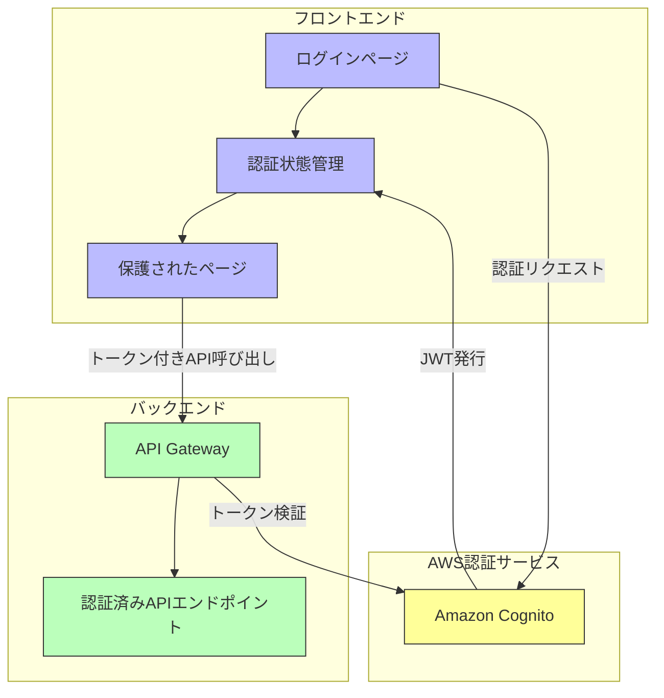
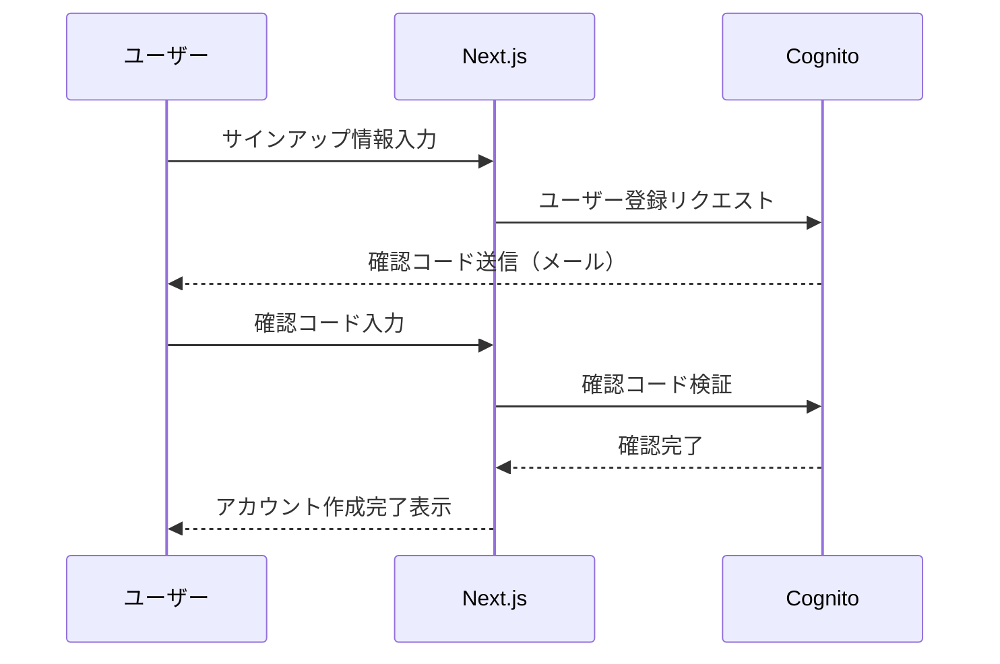
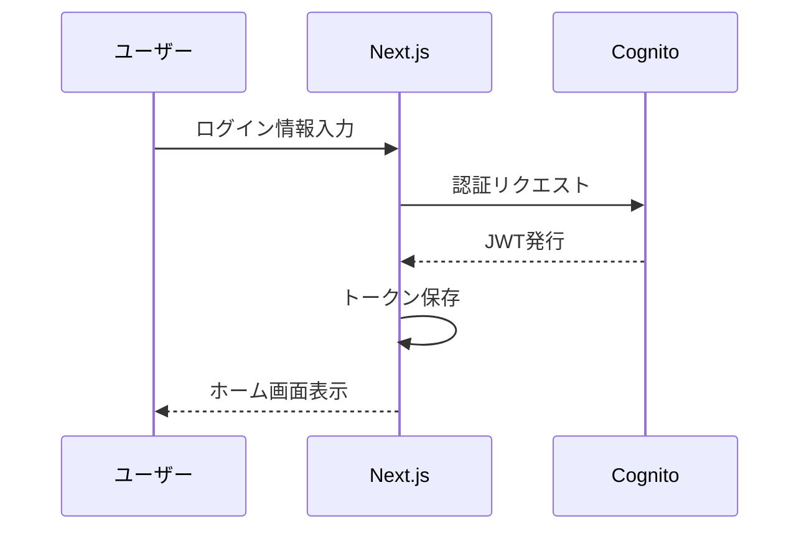
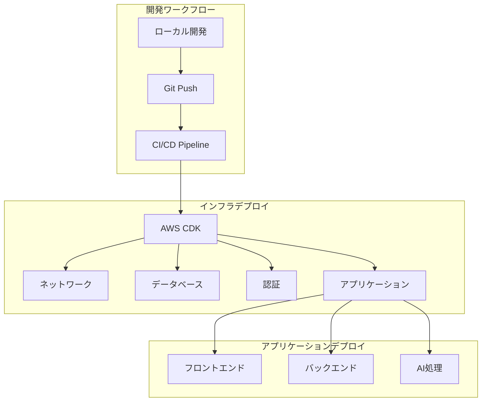

# 運用ガイド

## 1. 認証システム

### 1.1 認証アーキテクチャ

AI Recipe Generatorは、以下の図のように Amazon Cognito を使用した認証システムを実装しています。



### 1.2 認証フロー

#### サインアップフロー



#### サインインフロー



### 1.3 Amazon Cognito 設定

**ユーザープール設定:**
- サインアップ属性: メールアドレス（必須）、名前（任意）
- パスワードポリシー: 8文字以上、大文字小文字・数字を含む
- メール検証: 必須
- MFA: オプション

**アプリクライアント設定:**
- 認証フロー: Authorization Code Grant + PKCE
- OAuthスコープ: openid, email, profile
- コールバックURL: https://[アプリドメイン]/auth/callback

### 1.4 フロントエンド実装

Next.jsでは以下のようにAWS Amplify SDKを使用して認証を実装しています：

```typescript
// amplify-config.ts
import { Amplify } from 'aws-amplify';

Amplify.configure({
  Auth: {
    region: process.env.NEXT_PUBLIC_AWS_REGION,
    userPoolId: process.env.NEXT_PUBLIC_USER_POOL_ID,
    userPoolWebClientId: process.env.NEXT_PUBLIC_USER_POOL_CLIENT_ID,
    authenticationFlowType: 'USER_SRP_AUTH'
  }
});

// AuthContext.tsx (認証状態管理)
export const AuthProvider = ({ children }) => {
  const [user, setUser] = useState(null);
  
  useEffect(() => {
    checkCurrentUser();
  }, []);
  
  async function checkCurrentUser() {
    try {
      const user = await Auth.currentAuthenticatedUser();
      setUser(user);
    } catch {
      setUser(null);
    }
  }
  
  // サインイン・サインアウト関数...
  
  return (
    <AuthContext.Provider value={{ user, signIn, signOut }}>
      {children}
    </AuthContext.Provider>
  );
};
```

### 1.5 バックエンド実装

Spring BootでJWT認証を処理する実装例：

```java
@Configuration
@EnableWebSecurity
public class SecurityConfig {
    @Value("${aws.cognito.jwk-url}")
    private String jwkUrl;
    
    @Bean
    public SecurityFilterChain securityFilterChain(HttpSecurity http) throws Exception {
        http
            .cors().and()
            .csrf().disable()
            .sessionManagement().sessionCreationPolicy(SessionCreationPolicy.STATELESS)
            .and()
            .authorizeHttpRequests(auth -> auth
                .requestMatchers("/api/v1/public/**").permitAll()
                .anyRequest().authenticated()
            )
            .oauth2ResourceServer(oauth2 -> oauth2
                .jwt(jwt -> jwt.decoder(jwtDecoder()))
            );
        
        return http.build();
    }
    
    @Bean
    public JwtDecoder jwtDecoder() {
        return NimbusJwtDecoder.withJwkSetUri(jwkUrl).build();
    }
}
```

## 2. デプロイ手順

### 2.1 デプロイアーキテクチャ



### 2.2 必要なツール

- AWS CLI (設定済み)
- Node.js v18.x 以上
- Java 17 以上
- AWS CDK v2.x
- Docker (ローカルテスト用)

### 2.3 環境変数設定

環境ごとに設定ファイルを用意します：

```
# .env.dev (開発環境)
AWS_REGION=ap-northeast-1
COGNITO_USER_POOL_ID=ap-northeast-1_xxxx
COGNITO_CLIENT_ID=xxxxxxxxxxxx
API_ENDPOINT=https://api-dev.example.com
BEDROCK_MODEL_ID=anthropic.claude-3-sonnet-20240229-v1:0

# .env.prod (本番環境)
AWS_REGION=ap-northeast-1
COGNITO_USER_POOL_ID=ap-northeast-1_yyyy
COGNITO_CLIENT_ID=yyyyyyyyyyyy
API_ENDPOINT=https://api.example.com
BEDROCK_MODEL_ID=anthropic.claude-3-sonnet-20240229-v1:0
```

### 2.4 インフラデプロイ

AWS CDKを使用してインフラをデプロイします：

```bash
# プロジェクトディレクトリに移動
cd infrastructure

# 依存関係インストール
npm install

# 開発環境デプロイ
npx cdk deploy --all --context env=dev

# 本番環境デプロイ
npx cdk deploy --all --context env=prod
```

デプロイされるスタック：
- NetworkStack: VPC、サブネット
- DatabaseStack: RDS PostgreSQL
- AuthStack: Cognito ユーザープール
- ApiStack: API Gateway、Lambda
- StorageStack: S3、CloudFront
- AIStack: Bedrock連携

### 2.5 フロントエンドデプロイ

```bash
# フロントエンドディレクトリに移動
cd frontend

# 依存関係インストール
npm install

# 環境変数設定
cp .env.example .env.production
# 環境変数を編集...

# ビルド
npm run build

# S3へデプロイ
npm run deploy:prod
```

### 2.6 バックエンドデプロイ

```bash
# バックエンドディレクトリに移動
cd backend

# 依存関係インストール
mvn clean install

# ビルド
mvn package

# Lambdaへデプロイ
./deploy.sh prod
```

## 3. 環境管理

### 3.1 環境の分離

| 環境 | 用途 | URL |
|-----|-----|-----|
| 開発 (dev) | 開発・テスト | https://dev.recipe-app.example.com |
| 本番 (prod) | 本番運用 | https://recipe-app.example.com |

### 3.2 開発環境と本番環境の切り替え

**フロントエンド:**
```bash
# 開発環境で実行
npm run dev  # .env.development を使用

# 本番用ビルド
npm run build  # .env.production を使用
```

**バックエンド:**
```bash
# 開発環境で実行
mvn spring-boot:run -Dspring-boot.run.profiles=dev

# 本番環境用ビルド
mvn package -Dspring.profiles.active=prod
```

## 4. セキュリティ対策

### 4.1 認証セキュリティ

- トークンはHttpOnlyクッキーに保存
- トークン有効期限の適切な設定（ID: 1時間, リフレッシュ: 30日）
- HTTPS通信の強制
- CORS制限の実装

### 4.2 APIセキュリティ

- WAF（Web Application Firewall）の設定
- レート制限の実装
- 入力検証の徹底
- 最小権限のIAMポリシー設定

### 4.3 データセキュリティ

- データベース暗号化
- Lambda環境変数の暗号化
- S3バケットのアクセス制限
- Secrets Managerでの機密情報管理

## 5. モニタリングとログ

### 5.1 CloudWatch設定

AWS CloudWatchを使用して包括的なモニタリングとログ収集を行います：

- Lambda関数ログ
- API Gatewayアクセスログ
- RDS監視
- カスタムメトリクス：
  - レシピ生成成功率
  - AI処理時間
  - ユーザー認証成功率

### 5.1.1 CloudWatchダッシュボード

アプリケーションの主要指標を一目で確認できるカスタムダッシュボードを構築しています：


このダッシュボードには以下のウィジェットが含まれています：

- API Gateway 4XX/5XXエラー率
- Lambdaレイテンシーおよびエラー率
- RDSデータベース接続数とCPU使用率
- Bedrockモデル呼び出しの成功率とレイテンシー
- カスタムメトリクス：レシピ生成成功率、平均応答時間

AWS CDKを使用してダッシュボードを自動作成する例：

```typescript
const dashboard = new cloudwatch.Dashboard(this, 'RecipeAppDashboard', {
  dashboardName: 'RecipeApp-Dashboard',
});

dashboard.addWidgets(
  new cloudwatch.GraphWidget({
    title: 'API Gateway 4XX/5XX Errors',
    left: [
      apiGateway.metricClientError(),
      apiGateway.metricServerError(),
    ],
  }),
  new cloudwatch.GraphWidget({
    title: 'Lambda Function Metrics',
    left: [
      recipeFunction.metricDuration(),
      recipeFunction.metricErrors(),
    ],
  }),
  // 他のウィジェット...
);
```

### 5.2 アラート設定

```typescript
// CloudWatchアラーム設定例
new cloudwatch.Alarm(this, 'ApiErrorAlarm', {
  metric: apiGateway.metricServerError(),
  threshold: 5,
  evaluationPeriods: 1,
  alarmDescription: 'API Gateway 5XX errors',
  comparisonOperator: cloudwatch.ComparisonOperator.GREATER_THAN_THRESHOLD,
});
```

### 5.3 X-Rayトレース

AWS X-Rayを使用して分散トレースを実装し、アプリケーションのパフォーマンスボトルネックを特定します。

```typescript
// Lambda関数でのX-Ray有効化
new lambda.Function(this, 'ApiFunction', {
  // 他の設定...
  tracing: lambda.Tracing.ACTIVE,
});
```

## 6. コスト最適化

### 6.1 AWS無料枠の活用

- Lambda: メモリサイズの最適化（128-512MB）
- RDS: 開発環境はdb.t3.microを使用
- API Gateway: キャッシュの活用
- CloudFront: 適切なTTL設定
- Bedrock: 使用量の監視と制限

### 6.2 自動スケーリング設定

- Lambdaの自動スケーリング
- RDSの自動スケーリング無効化（無料枠制限を超えないため）

### 6.3 リソース最適化

```typescript
// コスト最適化されたLambda設定例
new lambda.Function(this, 'RecipeApiFunction', {
  runtime: lambda.Runtime.JAVA_17,
  code: lambda.Code.fromAsset('../backend/target/recipe-api.jar'),
  handler: 'com.recipe.app.LambdaHandler::handleRequest',
  memorySize: 512,  // コスト最適化されたメモリサイズ
  timeout: cdk.Duration.seconds(10),
  reservedConcurrentExecutions: 10,  // 同時実行数制限
});
```

## 7. 障害復旧

### 7.1 バックアップ戦略

- RDSの自動バックアップ（7日間保持）
- S3バケットのバージョニング
- CloudFormationスタックの状態保存

### 7.2 復旧手順

1. **データベース障害**
   - RDSスナップショットから復元
   - Point-in-Time Recoveryを使用

2. **アプリケーション障害**
   - 前バージョンへのロールバック
   - Blue/Greenデプロイによる切り戻し

3. **リージョン障害**
   - マルチリージョンバックアップから復元
   - 手動でのリソース再作成

## 8. よくある問題と解決策

### 8.1 認証関連

- **問題**: トークン期限切れによるAPIエラー
- **解決策**: リフレッシュトークンフローの実装、自動再試行ロジックの追加

### 8.2 デプロイ関連

- **問題**: CloudFormationスタックデプロイ失敗
- **解決策**: ログの確認、手動リソース削除後の再デプロイ

### 8.3 AI関連

- **問題**: Bedrockレスポンスのタイムアウト
- **解決策**: Lambda関数のタイムアウト延長、非同期処理への変更

## 9. アップデート手順

### 9.1 フロントエンドアップデート

```bash
# 変更をコミット
git commit -am "フロントエンド更新"

# 変更をプッシュ
git push origin main

# CI/CDパイプラインが自動的にデプロイを実行
# または手動デプロイ:
cd frontend
npm run build
npm run deploy:prod
```

### 9.2 バックエンドアップデート

```bash
# 変更をコミット
git commit -am "バックエンド更新"

# 変更をプッシュ
git push origin main

# CI/CDパイプラインが自動的にデプロイを実行
# または手動デプロイ:
cd backend
mvn package
./deploy.sh prod
```

### 9.3 データベースマイグレーション

```bash
# Flywayを使用したマイグレーション
cd backend
mvn flyway:migrate -Dflyway.configFiles=flyway-prod.conf
``` 