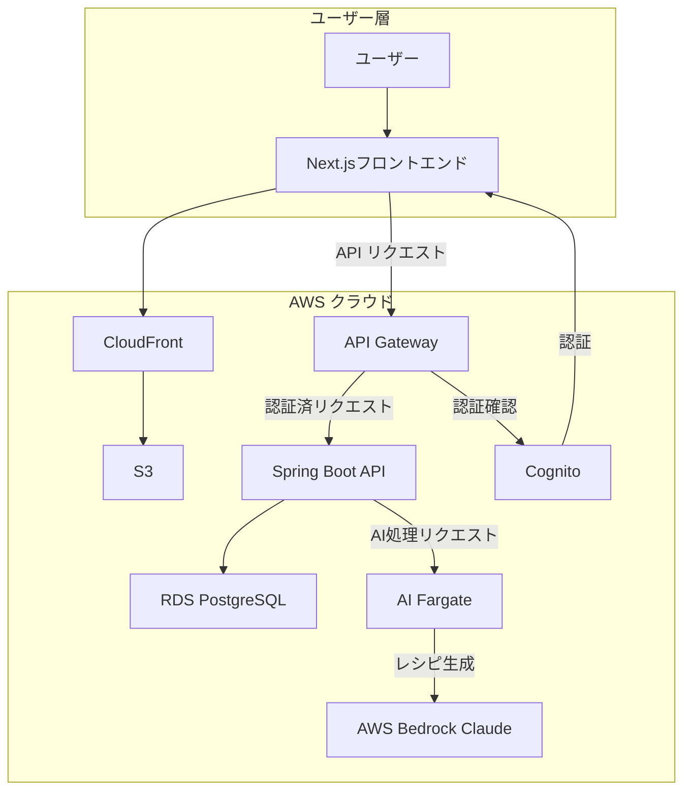
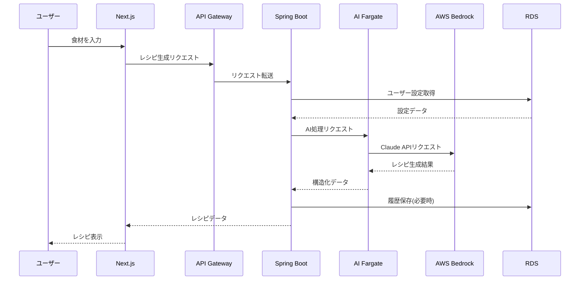
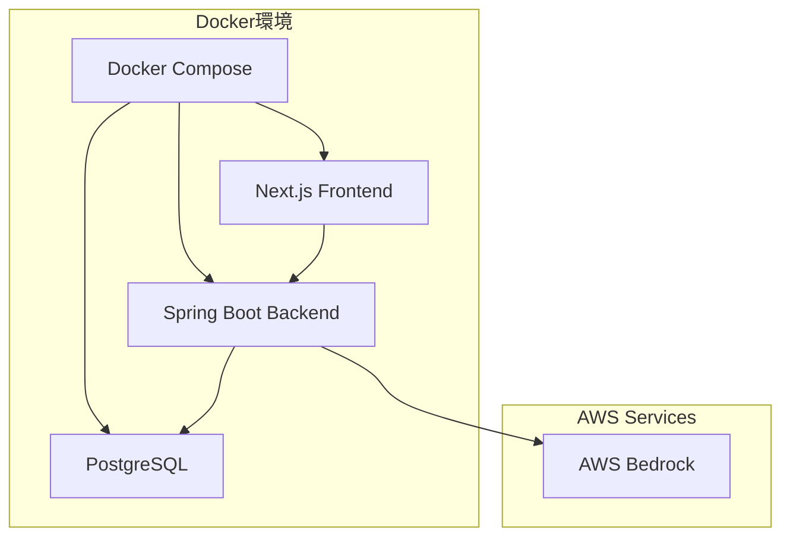

# システム設計 [計画/一部実装]

このドキュメントは現在の実装と将来の計画の両方を含んでいます。

## 1. アーキテクチャ概要 [計画]

AI Recipe Generatorは、フロントエンド、バックエンド、AIサービスを効率的に連携させたクラウドネイティブアプリケーションを目指しています。以下の図は全体のアーキテクチャ計画を示しています。



## 2. コンポーネント説明 [一部実装]

### 2.1 フロントエンド (Next.js) 

フロントエンドはNext.jsで構築され、現在はローカル開発環境で動作しています。将来的にはS3にホスティングされCloudFrontで配信される予定です。

**主要な責務:**
- ユーザーインターフェース提供
- フォーム入力と検証
- API通信の抽象化
- 認証状態の管理

**技術的特徴:**
- App Routerによるルーティング
- Zustandによる状態管理
- Tailwind CSSによるスタイリング
- APIクライアント層による通信抽象化

### 2.2 バックエンド (Spring Boot) [実装済み/一部計画]

バックエンドはSpring Bootで構築され、現在はローカル開発環境で動作しています。将来的にはAWS Fargateにデプロイする予定です。

**主要な責務:**
- ビジネスロジックの実装
- データ永続化の管理
- AIサービスとの連携
- 認証・認可の処理

**技術的特徴:**
- AWS Fargate最適化された設定
- Spring Security JWT認証
- Amazon RDS (PostgreSQL)接続
- マイクロサービス指向設計

### 2.3 AI処理サービス [実装済み/計画発展中]

AI処理は現在バックエンド内に統合されており、AWS Bedrockと直接連携しています。将来的には専用のFargate関数として分離する予定です。

**主要な責務:**
- プロンプトの構築と最適化
- AIモデル呼び出し
- レスポンス解析と構造化
- エラーハンドリングとリトライ

## 3. データフロー [一部実装]

### 3.1 レシピ生成フロー [実装済み]



### 3.2 ユーザー認証フロー [未実装]

## 4. AI設計 [実装済み]

### 4.1 AIモデル選定 [実装済み]

**Claude 3 Sonnet (Bedrock)を選定した理由:**
- 食材と料理の知識が豊富
- 構造化JSON出力機能に優れている
- 日本語を含む多言語対応
- 推論速度とコストバランスが優れている

### 4.2 プロンプト設計 [実装済み]

レシピ生成のためのプロンプトはシステムプロンプトとユーザープロンプトに分かれています。

**システムプロンプト:**
```
あなたは優秀な料理人アシスタントです。ユーザーが提供する食材リストと
オプションの好みに基づいて、創造的で実用的なレシピを提案します。
レシピは必ず指定された食材を使い、分かりやすく構造化された形式で提供して
ください。栄養バランス、調理時間、難易度を考慮し、初心者でも作れるよう
明確な手順を提供します。回答は必ずJSON形式で返します。
```

**ユーザープロンプト構造:**
```
与えられた食材（[食材リスト]）を使ったレシピを[数]つ考えてください。

【条件】
- 調理時間: [時間]
- 難易度: [難易度]
- 料理タイプ: [タイプ]
- 食事タイプ: [食事]
- カロリーレベル: [カロリー]
- 人数: [人数]人分

[指定されたJSON構造の説明]
```

### 4.3 AIレスポンス処理 [実装済み]

AIからのレスポンスは以下の処理が行われます：

1. **構造検証**: JSON構造の妥当性確認
2. **データ補完**: 不足情報の補完（必要に応じて）
3. **属性強化**: タグ付け・分類の強化
4. **エラー処理**: 不適切な応答や失敗時の処理

### 4.4 実装例 [実装済み]

```java
@Service
public class RecipeGenerationService {
    @Value("${bedrock.model-id}")
    private String modelId;
    
    public RecipeResponse generateRecipe(RecipeRequest request) {
        // プロンプト構築
        String prompt = promptBuilder.buildRecipePrompt(
            request.getIngredients(),
            request.getPreferences()
        );
        
        // AIモデル呼び出しと結果処理
        String aiResponse = bedrockClient.invokeModel(modelId, prompt);
        RecipeResponse response = responseProcessor.processAiResponse(aiResponse);
        
        return response;
    }
}
```

## 5. AWS構成の特徴 [計画]

### 5.1 AWSサービス構成詳細 [計画]

現在はローカル開発環境のみで実装されており、本番用AWSサービスの利用は計画段階です。

### 5.2 サーバーレスアーキテクチャ [未実装]

### 5.3 マイクロサービス分離 [未実装]

### 5.4 CDKによるインフラのコード化 [未実装]

## 6. セキュリティ設計 [計画]

### 6.1 AWSにおけるセキュリティ対策 [計画]

### 6.2 認証・認可 [未実装]

### 6.3 データ保護 [未実装]

### 6.4 API保護 [未実装]

## 7. スケーラビリティ設計 [計画]

### 7.1 AWSサービスによるスケーラビリティ確保 [計画]

### 7.2 リージョン間レプリケーション [計画]

### 7.3 ロードバランシング戦略 [計画]

## 8. 将来的な拡張性 [計画]

## 7. 開発環境 [実装済み]

### 7.1 Docker開発環境 [実装済み]

#### Docker環境の概要図



#### Docker環境の利点

1. **環境一貫性**: 全開発者が同一環境で開発可能
2. **依存関係の分離**: アプリケーションの依存関係をコンテナ内に閉じ込め
3. **簡単なセットアップ**: "docker-compose up"で環境構築
4. **本番環境への移行容易性**: コンテナ化によりクラウドへのデプロイが容易

詳細な Docker 環境のセットアップと使用方法については、[運用ガイド](./operations.md#8-docker開発環境)を参照してください。

### 7.2 開発ツール

開発には以下のツールを推奨します：

- **IDE**: IntelliJ IDEA または VS Code
- **API テスト**: Postman または REST Client
- **データベース管理**: DBeaver または pgAdmin
- **CI/CD**: GitHub Actions
- **ドキュメント**: Markdown + Mermaid 