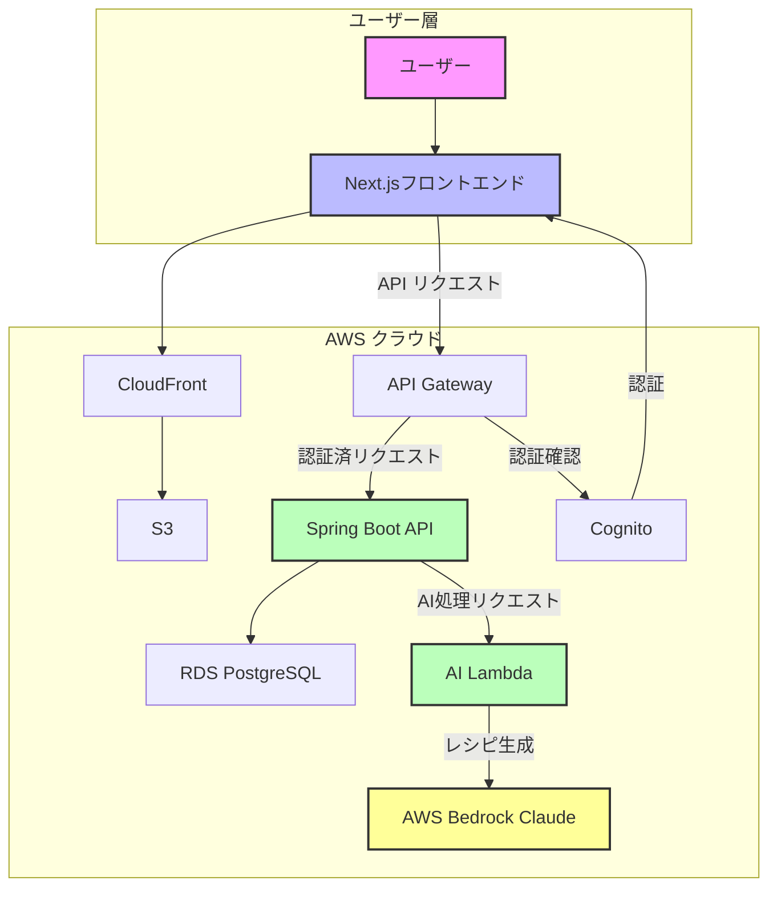
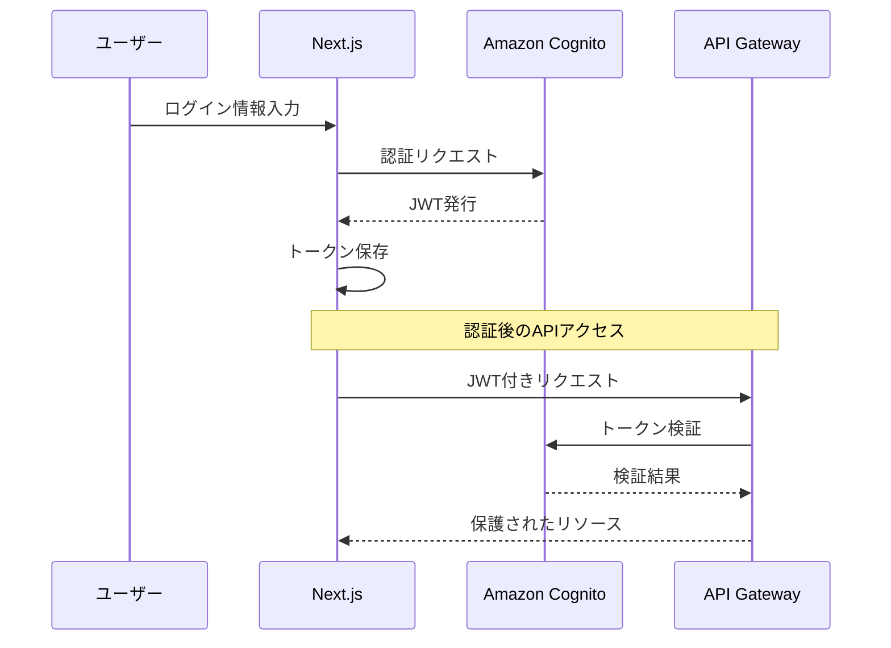

# システム設計

## 1. アーキテクチャ概要

AI Recipe Generatorは、フロントエンド、バックエンド、AIサービスを効率的に連携させたクラウドネイティブアプリケーションです。以下の図は全体のアーキテクチャを示しています。




## 2. コンポーネント説明

### 2.1 フロントエンド (Next.js)

フロントエンドはNext.jsで構築され、S3にホスティングされCloudFrontで配信されます。

**主要な責務:**
- ユーザーインターフェース提供
- フォーム入力と検証
- API通信の抽象化
- 認証状態の管理

**技術的特徴:**
- App Routerによるルーティング
- Zustandによる状態管理
- Tailwind CSSによるスタイリング
- APIクライアント層による通信抽象化

### 2.2 バックエンド (Spring Boot on Lambda)

バックエンドはSpring BootをAWS Lambdaにデプロイして提供します。

**主要な責務:**
- ビジネスロジックの実装
- データ永続化の管理
- AIサービスとの連携
- 認証・認可の処理

**技術的特徴:**
- AWS Lambda最適化された設定
- Spring Security JWT認証
- Amazon RDS (PostgreSQL)接続
- マイクロサービス指向設計

### 2.3 AI処理サービス

AI処理は専用のLambda関数を通じてAWS Bedrockと連携します。

**主要な責務:**
- プロンプトの構築と最適化
- AIモデル呼び出し
- レスポンス解析と構造化
- エラーハンドリングとリトライ

## 3. データフロー

### 3.1 レシピ生成フロー


### 3.2 ユーザー認証フロー



## 4. AI設計

### 4.1 AIモデル選定

**Claude 3 Sonnet (Bedrock)を選定した理由:**
- 食材と料理の知識が豊富
- 構造化JSON出力機能に優れている
- 日本語を含む多言語対応
- 推論速度とコストバランスが優れている

### 4.2 プロンプト設計

レシピ生成のためのプロンプトはシステムプロンプトとユーザープロンプトに分かれています。

**システムプロンプト:**
```
あなたは優秀な料理人アシスタントです。ユーザーが提供する食材リストと
オプションの好みに基づいて、創造的で実用的なレシピを提案します。
レシピは必ず指定された食材を使い、分かりやすく構造化された形式で提供して
ください。栄養バランス、調理時間、難易度を考慮し、初心者でも作れるよう
明確な手順を提供します。回答は必ずJSON形式で返します。
```

**ユーザープロンプト構造:**
```
与えられた食材（[食材リスト]）を使ったレシピを[数]つ考えてください。

【条件】
- 調理時間: [時間]
- 難易度: [難易度]
- 料理タイプ: [タイプ]
- 食事タイプ: [食事]
- カロリーレベル: [カロリー]
- 人数: [人数]人分

[指定されたJSON構造の説明]
```

### 4.3 AIレスポンス処理

AIからのレスポンスは以下の処理が行われます：

1. **構造検証**: JSON構造の妥当性確認
2. **データ補完**: 不足情報の補完（必要に応じて）
3. **属性強化**: タグ付け・分類の強化
4. **エラー処理**: 不適切な応答や失敗時の処理

### 4.4 実装例

```java
@Service
public class RecipeGenerationService {
    @Value("${bedrock.model-id}")
    private String modelId;
    
    public RecipeResponse generateRecipe(RecipeRequest request) {
        // 1. プロンプト構築
        String prompt = promptBuilder.buildRecipePrompt(
            request.getIngredients(),
            request.getPreferences()
        );
        
        // 2. AIモデル呼び出し
        String aiResponse = bedrockClient.invokeModel(modelId, prompt);
        
        // 3. レスポンス処理
        RecipeResponse response = responseProcessor.processAiResponse(aiResponse);
        
        // 4. 結果の保存と返却
        recipesRepository.saveGenerationHistory(response, request);
        return response;
    }
}
```

## 5. AWS構成の特徴

### 5.1 AWSサービス構成詳細

上記のアーキテクチャ図に示されているように、本システムは以下のAWSサービスを活用しています：

1. **フロントエンド**
   - **Amazon S3**: 静的Webアセットのホスティング
   - **Amazon CloudFront**: グローバルなコンテンツ配信とキャッシング
   - **AWS WAF**: Webアプリケーションの保護

2. **バックエンド**
   - **Amazon API Gateway**: RESTful APIのエンドポイント提供
   - **AWS Lambda**: サーバーレスバックエンド処理
   - **Amazon RDS (PostgreSQL)**: リレーショナルデータ永続化

3. **認証・認可**
   - **Amazon Cognito**: ユーザー認証と認可

4. **AI処理**
   - **AWS Bedrock**: 大規模言語モデル（Claude）へのアクセス
   - **専用Lambda**: AI処理を分離

5. **モニタリング・ロギング**
   - **Amazon CloudWatch**: ログ収集と監視
   - **AWS X-Ray**: 分散トレーシング

この構成により、高いスケーラビリティ、セキュリティ、そして柔軟性を実現しています。

### 5.2 サーバーレスアーキテクチャ

APIリクエストに応じてLambda関数が自動的にスケーリングし、使用分のみ課金されることで効率的なリソース利用を実現しています。

### 5.3 マイクロサービス分離

レシピ生成のAI処理は専用Lambda関数に分離し、メインのアプリケーション処理から独立させることで、スケーラビリティと保守性を向上させています。

### 5.4 CDKによるインフラのコード化

AWSリソースはすべてAWS CDKを使用してTypeScriptでコード化されており、環境ごとに一貫したデプロイが可能です。

```typescript
// インフラ定義の一部
const aiLambda = new lambda.Function(this, 'AIProcessorLambda', {
  runtime: lambda.Runtime.JAVA_17,
  code: lambda.Code.fromAsset('../ai-processor/target/ai-processor.jar'),
  handler: 'com.recipe.ai.LambdaHandler::handleRequest',
  memorySize: 512,
  timeout: cdk.Duration.seconds(30),
  environment: {
    BEDROCK_MODEL_ID: 'anthropic.claude-3-sonnet-20240229-v1:0',
    LOG_LEVEL: 'INFO'
  }
});

// Bedrockアクセス権限付与
aiLambda.addToRolePolicy(
  new iam.PolicyStatement({
    actions: ['bedrock:InvokeModel'],
    resources: [`arn:aws:bedrock:${this.region}::foundation-model/*`]
  })
);
```

## 6. セキュリティ設計

### 6.1 AWSにおけるセキュリティ対策

AWS Well-Architected Frameworkのセキュリティの柱に基づき、以下のセキュリティ対策を実装しています：

- **VPC内でのネットワーク分離**: プライベートサブネットにバックエンドリソースを配置
- **セキュリティグループによる通信制限**: 必要な通信のみを許可
- **IAMロールによる最小権限の原則**: サービスごとに必要最小限の権限を設定
- **AWS WAFによるWebアプリケーション保護**: XSS、SQLインジェクションなどの攻撃を防止
- **AWS KMSによるデータ暗号化**: 保存データと転送中のデータを暗号化
- **AWS Secrets Managerによる認証情報管理**: データベース認証情報などの機密情報を安全に管理

### 6.2 認証・認可

- Cognitoによるユーザー認証
- JWTベースのAPI認可
- 最小権限の原則に基づいたIAMロール設定

### 6.3 データ保護

- 転送中の暗号化(HTTPS/TLS)
- 保存データの暗号化(RDSの暗号化オプション)
- 機密情報の安全な管理(AWS Secrets Manager)

### 6.4 API保護

- APIキー管理
- AWS WAFによる保護
- APIゲートウェイでのレート制限の実装

## 7. スケーラビリティ設計

### 7.1 AWSサービスによるスケーラビリティ確保

本システムはAWSの各種サービスの特性を活かし、以下の方法でスケーラビリティを確保しています：

- **Lambda関数の自動スケーリング**: トラフィック増加に応じて自動的にスケールアウト
- **API Gatewayの高いスループット**: バーストトラフィックにも対応可能な設計
- **CloudFrontによるエッジキャッシング**: 地理的に分散したユーザーへの低レイテンシーアクセス
- **RDSの読み取りレプリカ対応**: 読み取りトラフィック増加時にスケールアウト可能
- **DynamoDBのオンデマンドキャパシティ**: 変動するトラフィックに応じた自動スケーリング

### 7.2 リージョン間レプリケーション

将来的な拡張として、複数リージョンにわたる高可用性構成を検討しています：

- **グローバルテーブル(DynamoDB)**: 複数リージョンでのデータレプリケーション
- **マルチリージョンS3バケット**: 静的コンテンツの地理的冗長性確保
- **Route 53によるリージョンフェイルオーバー**: 自動障害検出と切り替え

### 7.3 ロードバランシング戦略

- **API Gatewayのスロットリング**: 過剰なリクエストからバックエンドを保護
- **CloudFrontのキャッシュポリシー最適化**: オリジンへの負荷軽減
- **Lambda同時実行数の適切な設定**: コスト効率と応答性のバランス確保

## 8. 将来的な拡張性

このアーキテクチャは以下の拡張に対応できるよう設計されています：

1. **マルチモーダル対応**
   - 食材画像認識機能の追加
   - 生成レシピの画像生成(Bedrock Image Generation)

2. **パーソナライゼーション強化**
   - 機械学習ベースのレコメンデーション
   - ユーザーのフィードバックに基づく改善

3. **外部連携**
   - 食材配達サービスとの連携
   - 栄養管理アプリとの連携 